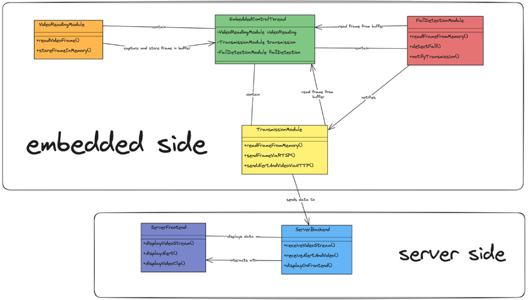
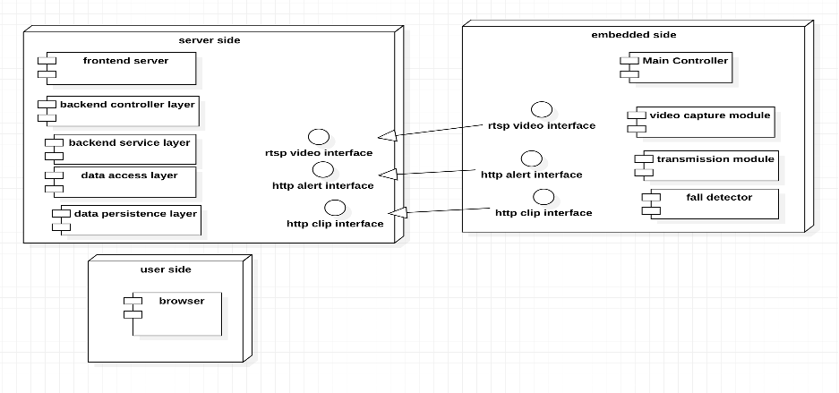
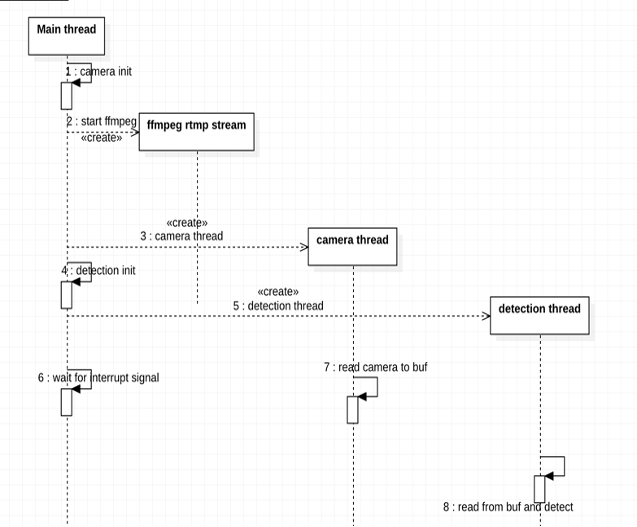
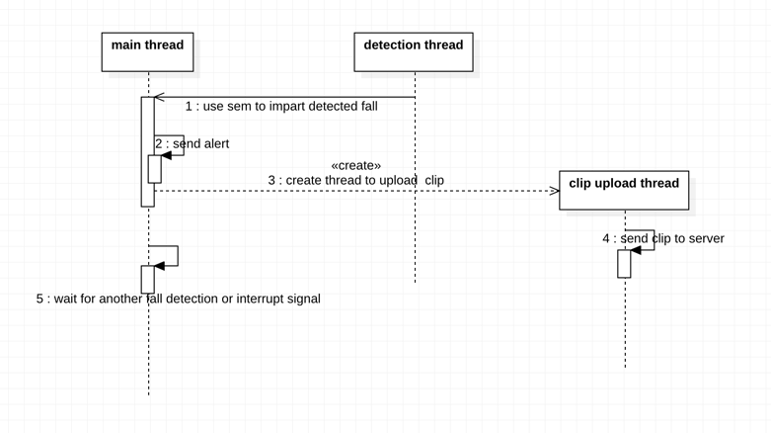

# Falling detection system for elderly people living alone

A falling detection system based on mobilenet v3, RDK X3 2.0 demo board (yahboom)


## Architecture Design

overall  
  


### embedded system

  
start up and has not detected falling

 
detected falling

### backend

## Prerequisites

Before you continue, ensure you have met the following requirements:

* RDK X3 2.0 demo board (yahboom)
* Prepare development environment following [the official instruction](https://developer.d-robotics.cc/api/v1/fileData/horizon_xj3_open_explorer_cn_doc/oe_mapper/source/env_install.html)
* a mipi camera ( here we used ov5647), other will be ok as well, but we recomand cameras with over 2 megapixels 
* requirements for backend server: Win7 and above, tomcat10.0, python3.10，MySQL
* You have installed the latest version of `<coding_language/dependency/requirement_1>`
* You have a `<Windows/Linux/Mac>` machine. State which OS is supported/required.
* You have read `<guide/link/documentation_related_to_project>`.
## Install

To install, follow these steps:
Prepare your RDK X3 following the official instruction [D-Robotics-quickstart](https://developer.d-robotics.cc/rdk_doc/Quick_start)

1. Download the this project and enter the folder.
2. Frontend
   ```
   npm run build
   cd ./nodejs
   npm init -y
   npm I express
   touch server.js
   mkdir public
   cp -r ./dist ./public
   cd public
   node ./server.js
   ```
4. backend
   ```
   cd Fall-Detection-System/FallDetection/pom.xml
   mvn clean package
   java -jar FallDetection-0.0.1-SNAPSHOT.jar
   ```
6. embedded
   * modify Fall-Detection-System/embedded_system/make/Makefile/ according to your development environment (the paths of compiler, packages and etc.)
   * modify Fall-Detection-System/embedded_system/conf.txt according to your backend server info
   * modify Fall-Detection-System/embedded_system/transmit_module/video_trans.c and Fall-Detection-System/embedded_system/transmit_module/video_upload.cpp (Due to time constraints, some hard coding issues have not been resolved yet.)
   ```
   cd Fall-Detection-System/embedded_system/make/
   make clean
   make all
   mkdir /home/sunrise/clip
   mkdir /home/sunrise/models
   mkdir /home/sunrise/sys_test
   chmod +x ./upload.sh
   sudo vim /etc/hosts/
   'ip of rdkx3' rdkx3
   ./upload.sh
   cp Fall-Detection-System/model/mobilenetv3-fall.bin /home/sunrise/models
   chmod +x /home/sunrise/sys_test/1no_fall
   ./1no_fall
   ```

## Contributing to <Project_Name>
<!-- Optional if you don't have others contributing to your project -->
To contribute to <Project_Name>, follow these steps:

1. Fork this repository.
2. Create a branch: `git checkout -b <branch_name>`.
3. Make your changes and commit them: `git commit -m '<commit_message>'`
4. Push to the original branch: `git push origin <Project_Name>/<location>`
5. Create the pull request.

Alternatively, see the GitHub documentation on [creating a pull request](https://help.github.com/en/articles/creating-a-pull-request).

## Contact

If you want to contact me you can reach me at `3508627758@qq.com`.

## License
<!-- This is optional if you don't have a license -->
This project uses the following license: MulanPSL-2.0 license.
